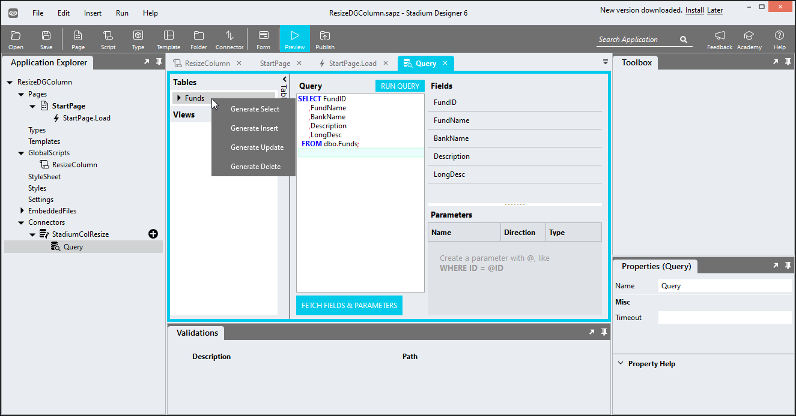
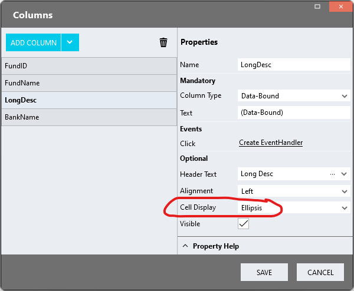
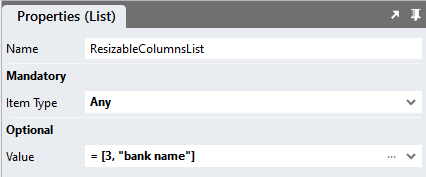
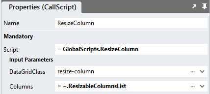

# Resize DataGrid Columns

Sometimes DataGrid columns contain more information than we can/want to show. In this case we can use the Ellipsis display option for that column. However, this means that some of the column content will not be visible to users. One option to mitigate this problem is to allow users to expand the column. 

https://github.com/stadium-software/resize-datagrid-columns/assets/2085324/ba261995-724b-4320-9b8c-09efdb88c0fa

## Version 
1.0

1.1 Converted readme to 6.12+; Changed px to rem; fixed non material design theme

# Setup

## Application Setup
1. Check the *Enable Style Sheet* checkbox in the application properties

## Global Script Setup
1. Create a Global Script called "ResizeColumn"
2. Add the input parameters below to the Global Script
   1. Columns
   2. DataGridClass
3. Drag a *JavaScript* action into the script
4. Add the Javascript below unchanged into the JavaScript code property
```javascript
/*Stadium Script v1.1 https://github.com/stadium-software/resize-datagrid-columns */
let dgClassName = ~.Parameters.Input.DataGridClass;
let table = document.querySelector("." + dgClassName + " table");
if (!table) { 
    console.error("No element with class '" + dgClassName + "' found");
    return false;
}
table.classList.add("stadium-resizable-columns");
let headingElements = table.querySelectorAll("thead th");
let arrHeadings = formatHeadings(headingElements);
let columns = ~.Parameters.Input.Columns;
const createResizableTable = function () {
    let colSelectors = "";
    let comma = "";
    for (let i = 0; i < columns.length; i++) {
        let col = columns[i];
        if (isNaN(parseFloat(col))) {
            col = getColumnNumber(col.toLowerCase().replaceAll(" ", ""));
        }
        if (!col) { 
            continue;
        }
        colSelectors += comma + "th:nth-child(" + col + ")";
        comma = ",";
    }
    const cols = table.querySelectorAll(colSelectors);
    [].forEach.call(cols, function (col) {
        const resizer = document.createElement("div");
        resizer.classList.add("resizer");
        col.appendChild(resizer);
        createResizableColumn(col, resizer);
    });
};
const createResizableColumn = function (col, resizer) {
    let x = 0;
    let w = 0;
    let tableWidth = 0;
    const mouseDownHandler = function (e) {
        for (let i = 0; i < headingElements.length; i++) { 
            headingElements[i].style.width = window.getComputedStyle(headingElements[i]).width;
            headingElements[i].style.minWidth = window.getComputedStyle(headingElements[i]).width;
        }
        col.style.minWidth = "unset";
        tableWidth = table.offsetWidth;
        x = e.clientX;
        const styles = window.getComputedStyle(col);
        w = parseInt(styles.width, 10);
        document.addEventListener("mousemove", mouseMoveHandler);
        document.addEventListener("mouseup", mouseUpHandler);
        resizer.classList.add("resizing");
    };
    const mouseMoveHandler = function (e) {
        const dx = e.clientX - x;
        col.style.width = w + dx + "px";
        table.style.width = tableWidth + dx + "px";
    };
    const mouseUpHandler = function () {
        resizer.classList.remove("resizing");
        document.removeEventListener("mousemove", mouseMoveHandler);
        document.removeEventListener("mouseup", mouseUpHandler);
    };
    resizer.addEventListener("mousedown", mouseDownHandler);
};
function getColumnNumber(title) {
    return arrHeadings.indexOf(title) + 1;
}
function formatHeadings(arr) {
    let headings = [];
    for (let i = 0; i < arr.length; i++) {
        headings.push(arr[i].textContent.toLowerCase().replaceAll(" ", ""));
    }
    return headings;
}
createResizableTable();
```

## Connector
1. Create a database called "StadiumFilterData" in your SQL Server
2. Run the SQL script in the data folder of this repo against that database to create a database table called "Funds" and to populate the data for the demo sample application
3. Add a connector for the Database to your application as per usual
4. Generate a query to select all data from the "Funds" table of the database



## Page Setup
1. Drag a *DataGrid* control to a page 
2. Add a class to the *DataGrid* classes property to uniquely identify the control (e.g. resize-column)
3. Assign columns to the DataGrid as per usual
4. Make sure the *Cell Display* property of all resizable columns is set to "Ellipsis"



## Page.Load Setup
1. Drag a *List* control into the Page.Load event handler and name it (e.g. ResizableColumnsList)
2. The List should be of type "Any"
3. In the *Value* property of the *List*, select *Items* in the dropdown or use the ... button to open the ListEditor
4. For each resizable column, add the column *HeaderText* or the column number (starting at 1)



5. Drag the Global Script called "ResizeColumn" into the Page.Load event handler
6. Provide values for the script input parameters
   1. Columns: Select the *List* called "ResizableColumnsList" from the dropdown
   2. DataGridClass: Enter the unique classname you added to this DataGrid (e.g. resize-column)



7. Populate your DataGrid as per usual
   1. Drag your query into the Page.Load event handler to execute it
   2. Assign the data to the *DataGrid* using a *SetValue* function

## CSS
The CSS below is required for the correct functioning of the module. Variables exposed in the [*css-file-variables.css*](css-file-variables.css) file can be [customised](#customising-css).

### Before v6.12
1. Create a folder called "CSS" inside of your Embedded Files in your application
2. Drag the two CSS files from this repo [*css-file-variables.css*](css-file-variables.css) and [*css-file.css*](css-file.css) into that folder
3. Paste the link tags below into the *head* property of your application
```html
<link rel="stylesheet" href="{EmbeddedFiles}/CSS/css-file.css">
<link rel="stylesheet" href="{EmbeddedFiles}/CSS/css-file-variables.css">
``` 

### v6.12+
1. Create a folder called "CSS" inside of your Embedded Files in your application
2. Drag the CSS files from this repo [*css-file.css*](css-file.css) into that folder
3. Paste the link tag below into the *head* property of your application
```html
<link rel="stylesheet" href="{EmbeddedFiles}/CSS/css-file.css">
``` 

### Customising CSS
1. Open the CSS file called [*css-file-variables.css*](css-file-variables.css) from this repo
2. Adjust the variables in the *:root* element as you see fit
3. Stadium 6.12+ users can comment out any variable they do **not** want to customise
4. Add the [*css-file-variables.css*](css-file-variables.css) to the "CSS" folder in the EmbeddedFiles (overwrite)
5. Paste the link tag below into the *head* property of your application (if you don't already have it there)
```html
<link rel="stylesheet" href="{EmbeddedFiles}/CSS/css-file-variables.css">
``` 
6. Add the file to the "CSS" inside of your Embedded Files in your application

**NOTE: Do not change any of the CSS in the 'css-file.css' file**

## Upgrading Stadium Repos
Stadium Repos are not static. They change as additional features are added and bugs are fixed. Using the right method to work with Stadium Repos allows for upgrading them in a controlled manner. 

How to use and update application repos is described here: [Working with Stadium Repos](https://github.com/stadium-software/samples-upgrading)